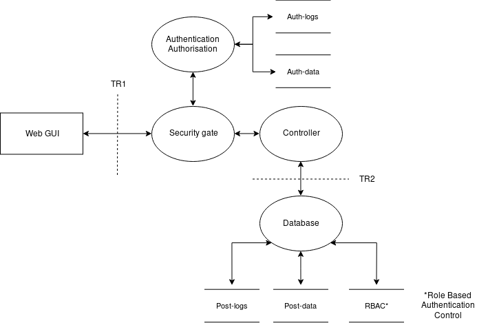

# Task overview

- Simple GUI
- Controller
- Database

- Sign up/login
- Create topics
- Post replies and new messages

- Visitors and logged in users into user groups
- Privileges and rights are given based on these groups

# Function requirements

## Forum posts

### Post handling

- Replies should refer to the post they answered
- Can create hierartical views of answers to organize a thread or show a linear thread based on arrival of answer
- Replies to hidden messages are still shown

### Post hierarchy

- Category (made by moderator or higher)
    - Thread (made by users or higher)
        - Messages and replies (made by users or higher)

## Usergroups

All groups should have a limited actions per unit time, e.g can post 1 message per 5 seconds.

_Higher level usergroups have all the privileges of the lower usergroups_

- Admin
    - administrate usergroups
    - hide categories/threads/messages[^delmsg]
- Moderator
    - hide messages[^delmsg]
    - add/alter categories
- User
    - create threads/messages
    - change your own threads/messages
    - hide your own threads/messages[^delmsg]
- Visitors
    - view categories/threads/messages

[^delmsg]: should not directly delete the messages, because an attacker that
get elevated privilages could then delete items from the database

## Functional requirements of processes

### Webclient

- Encrypted communication with the server (HTTPS)
- Simple input validation to ease the load on server
- Login and registration form
- Display categories/threads/messages

### Security gate

- Authenticate users against the authentication service
- Replace user specific token with internal id
- Reject inavalid requests based on authorization

### Controller

- Strong input validation (reject all invalid requests)
- Host the webclient
- Handle POST and GET requests to the database

### Authentication controller

- Gives back a token or similar which is connected to the internal id (usergroup) of the
  user

### Database

- Vertification of authorization before every write operation
- Separate auth and post database (post database contains simple user info to a user to a post)

# Security requirements

- Vertification of user
  - user, visitor, moderator
- Input validation
  - reject invalid requests
- Logging activities
  - should prevent non-repudiation
- Password vertification
  - minimum 6 characters
  - big and small letters and numbers
  - use both salt and pepper next to the password in the hashing

## Use cases

The system allows:

- users to login to be authenticated
- users to create threads and messages
- moderators to create/alter categories
- admins to change the usergroup of a user

## Abuse cases

An attacker tries to:

- gain extra privileges in the system
- post/delete messages/threads on behalf of another user
- perform a DoS attack on the server
- fill the forum with random data

## Objectives[^objectives]

- **Identification and authentication**: ensures that users and applications are
  correctly identified and the identities are verified

  - Through username and password with an authentication server

- **Authorization**: Ensures that users and applications can only access data and
  functions they are authorized to

  - Users are added to usergroups based on roles in the system

- **Immunity**: prevent unauthorized code and programs from infecting the
  application

  - Input validation and sanitation of input

- **Intrusion detection**: detect any attempt to intrude into the system

  - Logging

- **Integrity**: ensure the integrity of data and communication channels, i.e.,
  they are not corrupted

  - HTTPS

- **Non-repudiation:** ensure that users and entities can not deny (not) performing
  an interaction

  - Logging

- Ensure that users and entities can not replicate and an interaction that has
  already been performed and finished

  - Token based

- **Privacy:** ensure that confidentiality data and communications, i.e., they are
  kept secret

  - HTTPS

- **Security auditing**: ensure the possibility to audit and monitor the status of
  critical and security functions

  - Logging
  - Testing (static analysis)
  - Code review

- **Survivability and physical protection**: ensure that the applications and
  systems (including personnel) are protected and can survive and recover from
  attacks

  - Frequent backups of the database
  - Lock the door

- **Secure maintenance**: ensure secure maintenance and secure operations

  - Monitor the logs

[^objectives]: https://resources.sei.cmu.edu/library/asset-view.cfm?assetID=30108

# DFD-diagram

See [assets/dfd.xml](assets/dfd.xml) which is a diagram created using [draw.io](draw.io)

