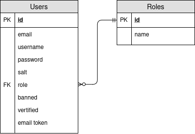
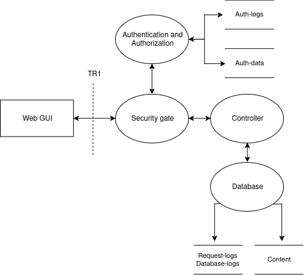

# Task overview

- Simple GUI
- Controller
- Database

- Sign up/login
- Create topics
- Post threads and comments

- Visitors and logged in users into user groups
- Privileges and rights are given based on these groups

# Function requirements

## Forum hierarchy

- Category (made by moderator or higher)
    - Thread (made by users or higher)
        - Comments (made by users or higher)

## Comment handling

- Comments should refer to the post they answered
- Can create hierartical views of answers to organize a thread or show a linear thread based on arrival of answer
- Comments to hidden comments are still shown

## Functional requirements of processes

### Webclient

- Encrypted communication with the server (HTTPS)
- Simple input validation to ease the load on server
- Login and registration form
- Display categories/threads/comments

### Security gate

- Authenticate users against the authentication service
- Replace user specific token with internal id
- Reject inavalid requests based on authorization

### Controller

- Strong input validation (reject all invalid requests)
- Host the webclient
- Handle POST and GET requests to the database

### Authentication controller

- Gives back a token or similar which is connected to the internal id (usergroup) of the
  user

### Database

- Separate authentication and post database
- Relational (SQL) database
    - good for structured data
    - data consistency through ACID

# Security requirements

## Objectives[^objectives]

- **Identification and authentication**: ensures that users and applications are
  correctly identified and the identities are verified

    - Through username and password with an authentication server

- **Authorization**: Ensures that users and applications can only access data and
  functions they are authorized to

    - Users are added to usergroups based on roles in the system

- **Immunity**: prevent unauthorized code and programs from infecting the
  application

    - Input validation and sanitation of input

- **Intrusion detection**: detect any attempt to intrude into the system

    - Logging

- **Integrity**: ensure the integrity of data and communication channels, i.e.,
  they are not corrupted

    - HTTPS

- **Non-repudiation:** ensure that users and entities can not deny (not) performing
  an interaction

    - Logging

- Ensure that users and entities can not replicate and an interaction that has
  already been performed and finished

    - Token based

- **Privacy:** ensure that confidentiality data and communications, i.e., they are
  kept secret

    - HTTPS

- **Security auditing**: ensure the possibility to audit and monitor the status of
  critical and security functions

    - Logging
    - Testing (static analysis)
    - Code review

- **Survivability and physical protection**: ensure that the applications and
  systems (including personnel) are protected and can survive and recover from
  attacks

    - Frequent backups of the database
    - Lock the door

- **Secure maintenance**: ensure secure maintenance and secure operations

    - Monitor the logs

[^objectives]: https://resources.sei.cmu.edu/library/asset-view.cfm?assetID=30108

## Usergroups

All groups should have a limited actions per unit time, e.g can post 1 message per 5 seconds.

_Higher level usergroups have all the privileges of the lower usergroups_

- Admin
    - administrate usergroups
    - hide categories/threads/comments[^delmsg]
- Moderator
    - hide comments
    - add/alter categories
    - ban/unban users
- User
    - create threads/comments
    - change your own threads/comments
    - hide your own threads/comments
- Visitors
    - view/search categories/threads/comments/users

[^delmsg]: should not directly delete the comments to prevent vulnerabilities to cause the ability to delete parts of the database.

## Use cases

The system allows:

- users to login to be authenticated
- users to create threads and comments
- moderators to create/alter categories
- admins to change the usergroup of a user

## Abuse cases

An attacker tries to:

- gain extra privileges in the system
- post/delete comments/threads on behalf of another user
- perform a DoS attack on the server
- fill the forum with random data

## DFD-diagram

