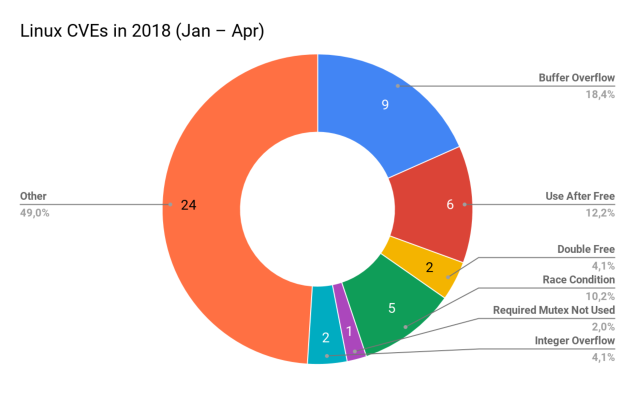

# Frontend

## Frameworks and libraries

### Preact (React)

- Many tutorials and libraries
- Component based system
- Use JavaScript to make view components

### Vuejs

- Many tutorials and libraries
- Components + templating
- Simple inline components and actions

### No framework

- Pure
- Complex UI can be hard to do well
- "Don't reinvent the wheel" (remaking common functionality which is provided by libraries)

## Conclusion

- All frameworks/libraries are quite similar
- No framework seems like a bad solution because it will require substantially more effort for the same functionality
- Speed is key (short time constraint to make a GUI)

# Backend

## Languages

### Rust

See [rust-lang.org] for more information about Rust.

#### Pros

- Statically and strongly typed (static analysis)
- Documentation lives next to the code (with docs-generator)
- Built-in test management
- Built-in package manager
- Zero-cost abstractions (high-level code still runs fast)
- No garbage collector (no overhead)
- High-level concepts (iteration, channels, enums)
- Guaranteed memory safety (no buffer overflow vuln.)
- Threads without data races (no data races which may lead to vuln.)
- Strong type system with ownership forces good solutions
- Encapsulate errors into the type system (forces the programmer to deal with errors)
- Advanced pattern matching on value and type
- Catch errors at compile-time

> The right part of the chart above shows concurrency and memory safety issues that are fundamentally impossible to get in the safe subset of Rust.
>
> --- medium.com - Why Use Rust[^medwhyrust]

[^medwhyrust]: https://medium.com/paritytech/why-rust-846fd3320d3f

#### Cons

- A steep learning curve (different concepts like move semantics and lifetimes)
- Few implicit actions make code explicit and verbose
- A young language, hence libraries not as sleek as other languages
- Writing code efficiently requires a different mindset than other languages, which can be hard in the beginning

### Golang

See [golang.org] for more information about Golang.

#### Pros

- Go routines and channels (built-in) make concurrency easier
- Statically typed (static analysis)
- Garbage collection makes memory management easy
- Powerful standard library

#### Cons

- Lack of generics (rather uses `interface {}` which in a sense is `*void`)
- No operator overloading or keyword extensibility
- Use of `nil` (null pointer) subverts the type system and can lead to unexpected runtime errors
- No immutability declarations (all data is inherently mutable), which can lead to unwanted mutations

See [Why Go is not good] for deeper explanations of the above points.

Also see [How Go and Rust compare] and [Rust vs Go].

[How Go and Rust compare]: https://www.quora.com/How-do-Go-and-Rust-languages-compare/answer/Costya-Perepelitsa
[Rust vs Go]: https://jaredforsyth.com/posts/rust-vs-go/
[Why Go is not good]: http://yager.io/programming/go.html

### PHP

See [php.net] for more information about PHP.

#### Pros

- Lots of PHP frameworks available which help with development

PHP people love frameworks, and with frameworks such as Laravel, you can build a web app or API really fast (Facades, ORMs, scaffolding etc.)

- Most prominent language for web applications

Part of the de facto standard web application stack.

#### Cons

- Poorly designed language

Despite its widespread use, PHP is generally looked upon poorly from a design point of view. The consistency of function names and function argument order, lazily and borderline non-functional implementation of object oriented programming, can only receive requests via POST methods, slow version adoption (the PHP you learn right now may not work on every webserver you'll work on), and a focus on "hacking things together" rather than "doing it right". These are all very common complaints when it comes to working with PHP. While not a bad language to learn, PHP is not at all a good language to learn first, as it will probably teach bad habits.

- Most tutorials are out of date

A lot of very bad tutorials are still widely circulated among beginners, and these tutorials teach very poor programming practices.

- Immense catalog of insecure frameworks

The most serious security problems in websites on the web today are almost universally found in popular PHP frameworks, CMS platforms, libraries and code samples, almost all stemming from poor language design, bad tutorials and awful resources.

- Most resources are poorly-written

Few resources exemplify the "correct" or secure use of features.

These points are taken from [PHP vs Rust].

See [PHP - A Fractal of Bad Design] for more information about some of the hard parts of PHP.

See [10 Most Common Mistakes PHP-Programmers Make] for some examples of how easy it is to make security bugs in a PHP codebase.

[PHP vs Rust]: https://www.slant.co/versus/125/5522/~php_vs_rust
[PHP - A Fractal of Bad Design]: https://eev.ee/blog/2012/04/09/php-a-fractal-of-bad-design/
[10 Most Common Mistakes PHP-Programmers Make]: https://www.toptal.com/php/10-most-common-mistakes-php-programmers-make

## Database

See [SQLite vs MySQL vs PostgreSQL] for a comparison of different relational databases. Based on the conclusions made in this article, I suggest using **MySQL**, because it's simple and fast.

[SQLite vs MySQL vs PostgreSQL]: https://www.digitalocean.com/community/tutorials/sqlite-vs-mysql-vs-postgresql-a-comparison-of-relational-database-management-systems

## Security gate

### Rust + Rocket

Using Rust with [rocket.rs] makes the API-endpoints into simple functions which makes the overall structure easy and extensible.

### Golang + mux

Using Golang with [mux] makes it simple to create an extensive router which handles requests.

### PHP

Using built-in features of PHP ...

## Controller

### Rust + Diesel

[diesel.rs] is a ORM for Rust which makes managing the database schema easy. This framework encodes SQL types into Rust, so that all queries will be verified at compile time. This creates a clear separation between data and query (prepared statement).

### Golang + gorp

[gorp] is a minimal ORM for Golang which lets us encode the database schema into Go-types. This makes insertions and extractions easy.

### PHP

PHP has a built-in library, [phpmysql], for sending SQL-queries to the database. Because PHP is dynamically typed, there is no way to verify types at compile time.

## Authentication and Authorization Service

### Rust

Rust is a type safe language which eliminates common vulnerabilities, such as buffer overflow, because of it's ownership paradigm. This makes this language highly suitable for a authentication and authorization service where it is vital that the server doesn't behave or crash unexpectedly. This would ensure the security of our users sensitive information.

### Golang

Golang is a statically typed language where we could perform static analysis. This would be beneficial to make sure the service doesn't expect or crash unexpectedly.

### PHP

PHP seems like a bad fit an authentication and authorization service as the language is dynamically typed and famously hard to make secure, which means that it can be hard to detect bugs. Bugs in the authentication/authorization service could compromise the entire system.

## Conclusion

We do not have to chose a single language for all of the processes, but it could be beneficial.

[mysql]: https://www.mysql.com/
[postgresql]: https://www.postgresql.org/

[rust-lang.org]: https://www.rust-lang.org/en-US/
[rocket.rs]: https://rocket.rs/
[diesel.rs]: http://diesel.rs/

[golang.org]: https://golang.org/
[gosql]: https://golang.org/pkg/database/sql/
[gorp]: https://github.com/go-gorp/gorp
[mux]: http://www.gorillatoolkit.org/pkg/mux

[php.net]: https://secure.php.net/
[phpmysql]: https://secure.php.net/manual/en/book.mysql.php
[phpsqlite]: https://secure.php.net/manual/en/book.sqlite.php
[pgsql]: https://secure.php.net/manual/en/book.pgsql.php
